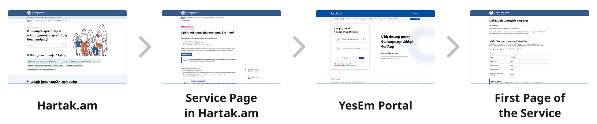

# Unique Service Links for Hartak.am

**Integration Document** \
April 2025 v2.0

## Table of Contents

1. [Introduction](#1-introduction)
2. [Background](#2-background)
3. [Unique Service Link Standard (Recommended)](#3-unique-service-link-standard-recommended)
4. [Technical Implementation (Recommended)](#4-technical-implementation-recommended)
   - [4.1. Proposed Flow](#41-proposed-flow)
5. [Code Examples](#5-code-examples)

## 1. Introduction

This document outlines the standard for **unique service links** that
will redirect users from Hartak.am to the YesEm Authentication Platform
and then to the Service Portal, ensuring a seamless user experience
during the process.

## 2. Background

Hartak.am is the Armenian National Service Gateway, serving as a
one-stop-shop for Armenian public services and a trusted source of
information. However, it does **not** **host services directly**.
Instead, it provides links to various service portals where the actual
services are hosted as shown in the diagram.


**User Journey with Unique Service Link**

- A citizen visits Hartak.am to find a specific service for example 3-in-1 Birth of a Child Service.

- They search for the service and navigate to its description page.

- Upon clicking the **Continue** button, they are redirected to the YesEm Authentication Portal.

- After successful authentication, the user is redirected to the **start page** of the respective **service**, where they can start using the service.



## 3. Unique Service Link Standard (Recommended)

ISAA's Technical Team recommends the following structure for unique service links:


- **Root URL**: The base URL of the service portal.

- **Directory <span style="color:#d96d46">/services**</span>: Specifies that the link pertains to a service.

- **<span style="color:#7b1ed8">/\[serviceId\]</span>**: Service ID from the National Service Catalog(Get Service ID by contacting ISAA via [service.admin@isaa.am](mailto:service.admin@isaa.am).

A standardized unique service link format is important to ensure
consistency across services and portals and simplify maintenance in the
service catalog.

## 4. Technical Implementation (Recommended)

To keep the separation of concerns, we recommend using the following
technical implementation.

### 4.1. Proposed Flow

- The user clicks on a service link from Hartak.am.

- Hartak.am programmatically opens the unique service link in a new tab in the browser.

- As soon as the unique service link page loads an API call is made to the Service Portals\' backend

- The backend stores the service start page URI in a cookie(redirect_uri).

- The backend immediately redirects the user to the YesEm Authentication Portal.

- After successful authentication in the YesEm Authentication Portal, the backend establishes a session and redirects the user to the URI stored in the cookie(redirect_uri).

## 5. Code Examples

This is an example of the Authentication Endpoint that stores the gets
the URI of the first page of the Service and stores it in the cookies.

---

```ts
app.get('/authenticate', (req, res) => {
  const code_verifier = generators.codeVerifier();
  const code_challenge = generators.codeChallenge(code_verifier);
  const state = generators.state();

  // This is the URL of the first page of the service
  const redirect_uri = getRedirectUriForService();

  const url = client.authorizationUrl(...);

  const cookieOptions = {
    httpOnly: true,
    secure: true,
    maxAge: 600000 // 10 minutes in milliseconds (OAuth 2.0 BCP recommends 5-10 mins)
  };

  res.cookie('code_verifier', AES256Encrypt(code_verifier, encryptionSecret), cookieOptions);
  res.cookie('state', AES256Encrypt(state, encryptionSecret), cookieOptions);
  res.cookie('redirect_uri', redirect_uri, cookieOptions);

  res.redirect(url);
});

```

This is an example of the callback endpoint that retrieves the URI of
the first page of the first page of the service from the cookies and
redirects the user to that page.

```ts
app.get('/handleCallback', async(req, res) => {
  const params = client.callbackParams(req);

  const code_verifier = AES256Decrypt(req.cookies.code_verifier, encryptionSecret);
  const state = AES256Decrypt(req.cookies.state, encryptionSecret);
  const redirect_uri = req.cookies.redirect_uri;

... // Establish session

  // Don't forget to clean the cookies
  res.clearCookie('code_verifier');
  res.clearCookie('state');

  res.redirect(redirect_uri);
});
```
