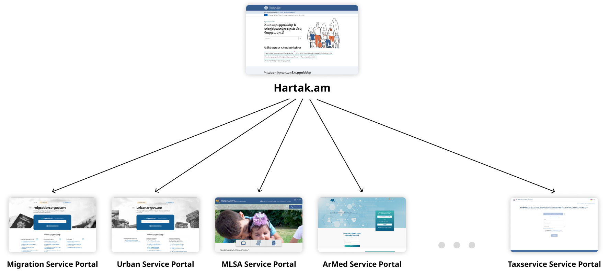
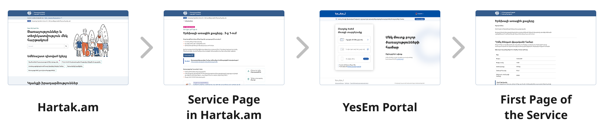
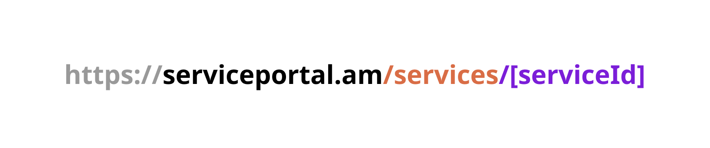

# Ծառայությունների եզակի հղումների ստեղծում Hartak.am-ի համար

**Ինտեգրման փաստաթուղթ** \
Փետրվար 2025 v1.0

# Բովանդակություն

1. [Ներածություն](#1-ներածություն)
2. [Նախապատմություն](#2-նախապատմություն)
3. [Առաջարկվող ստանդարտ ծառայությունների եզակի հղումների ստեղծման համար](#3-առաջարկվող-ստանդարտ-ծառայությունների-եզակի-հղումների-ստեղծման-համար)
4. [Առաջարկ տեխնիկական իրականացման համար](#4-առաջարկ-տեխնիկական-իրականացման-համար)
   - [4.1. Առաջարկվող ճանապարհը](#41-առաջարկվող-ճանապարհը)
5. [Կոդի օրինակներ](#5-կոդի-օրինակներ)

## 1. Ներածություն

Այս փաստաթուղթը նկարագրում է ստանդարտ մոտեցումը ծառայությունների եզակի հղումների ստեղծման համար, որոնք օգտատերերին Hartak.am-ից պետք է ուղղորդեն թվային նույնականացման «ԵսԵմ» հարթակ, ապա՝ ծառայության մատուցման հարթակ՝ ապահովելով օգտատիրոջ անխափան փորձառությունը ողջ գործընթացում։

## 2. Նախապատմություն

Hartak.am-ը Հայաստանում մատուցվող ծառայությունների ազգային հարթակն է, որը ծառայում է որպես մեկ միասնական կետ հանրային ծառայությունների և վստահելի տեղեկատվության համար։ Այնուամենայնիվ, **Հարթակում ծառայություններ ուղղակիորեն չեն մատուցվում**։ Փոխարենը այն տրամադրում է հղումներ դեպի ծառայությունների մատուցման տարբեր հարթակներ, որտեղ տեղակայված են ծառայությունները, ինչպես ցույց է տրված գծապատկերում՝



**Օգտատիրոջ փորձառությունը եզակի հղումներով ծառայությունների դեպքում**

- Իրեն անհրաժեշտ ծառայությունը (Օրինակ՝ «Երեխայի ծննդյան 3-ը 1-ում» ծառայություն) գտնելու համար օգտատերն այցելում է hartak.am:
- Փնտրում է ծառայությունը և այցելում դրա նկարագրության էջ։
- Սեղմելով **«Շարունակել»** կոճակը՝ ուղղորդվում է թվային նույնականացման «ԵսԵմ» հարթակ։
- Նույնականացումից հետո օգտատերն ուղղորդվում է համապատասխան **ծառայության մեկնարկային էջ**, որտեղ կարող է սկսել օգտվել ծառայությունից:



## 3. Առաջարկվող ստանդարտ ծառայությունների եզակի հղումների ստեղծման համար

ՀՏՀԳ-ի տեխնիկական թիմը ծառայությունների եզակի հղումների համար առաջարկում է հետևյալ կառուցվածքը՝



- **Սկզբնաղբյուրի հղումը (URL)**: Ծառայության մատուցման հարթակի հիմնական հղումն է։

- **Directory <span style="color:#d96d46">/services**</span>: Հստակեցնում է, որ հղումը վերաբերում է ծառայություններին։

- **<span style="color:#7b1ed8">/\[serviceId\]</span>**: Ծառայության նույնականացման համարն է Ծառայությունների ազգային կատալոգից (ծառայության ID-ն ստանալու համար կարող եք կապ հաստատել ՀՏՀԳ-ի հետ էլեկտրոնային փոստի հետևյալ հասցեով՝ [service.admin@isaa.am](mailto:service.admin@isaa.am)).

- **<span style="color:#004fa3">/login<span>**: Նշում է, որ հղումն օգտատերերին անմիջապես կուղղորդի թվային նույնականացման «ԵսԵմ» հարթակ։

Ծառայությունների եզակի հղումների համար ստանդարտացված ձևաչափի կիրառումն անչափ կարևոր է ծառայությունների և հարթակների միասնական մոտեցումը պահպանելու և Ծառայությունների ազգային կատալոգի արդունավետ սպասարկումն ապահովելու համար։

## 4. Առաջարկ տեխնիկական իրականացման համար

Առաջարկում ենք կիրառել տեխնիկական իրականացման հետևյալ տարբերակը․

### 4.1. Առաջարկվող ճանապարհը

- Օգտատերը սեղմում է ծառայության հղումը Hartak.am-ից։
- Hartak.am-ը նախապես ծրագրավորմամբ ծառայության եզակի հղումը բացում է դիտարկչի նոր պատուհանում։
- Ծառայության եզակի հղմամբ էջի բեռնումից հետո API հարցում է ուղարկվում ծառայության մատուցման հարթակի backend-ին։
- Backend-ը պահում է ծառայության մեկնարկային էջի URI-ը cookie-ներում (redirect_uri):
- Backend-ը օգտատիրոջն անմիջապես ուղղորդում է թվային նույնականացման «ԵսԵմ» հարթակ։
- Նույնականացումից հետո backend-ը session է ստեղծում և օգտատիրոջն ուղղորդում cookie-ներում (redirect_uri) պահպանված URI-ին։

## 5. Կոդի օրինակներ

Սա Authentication Endpoint-ի օրինակ է, որը ստանում է ծառայության առաջին էջի հղումը (URI) և պահում այն cookie-ներում։

---

```ts
app.get('/authenticate', (req, res) => {
  const code_verifier = generators.codeVerifier();
  const code_challenge = generators.codeChallenge(code_verifier);
  const state = generators.state();

  // This is the URL of the first page of the service
  const redirect_uri = getRedirectUriForService();

  const url = client.authorizationUrl(...);

  const cookieOptions = {
    httpOnly: true,
    secure: true,
    maxAge: 600000 // 10 minutes in milliseconds (OAuth 2.0 BCP recommends 5-10 mins)
  };

  res.cookie('code_verifier', AES256Encrypt(code_verifier, encryptionSecret), cookieOptions);
  res.cookie('state', AES256Encrypt(state, encryptionSecret), cookieOptions);
  res.cookie('redirect_uri', redirect_uri, cookieOptions);

  res.redirect(url);
});

```

Սա Callback Endpoint-ի օրինակ է, որը cookie-ներից վերցնում է ծառայության առաջին էջի հղումը (URI) և օգտատիրոջն ուղղորդում այդ էջ։

```ts
app.get('/handleCallback', async(req, res) => {
  const params = client.callbackParams(req);

  const code_verifier = AES256Decrypt(req.cookies.code_verifier, encryptionSecret);
  const state = AES256Decrypt(req.cookies.state, encryptionSecret);
  const redirect_uri = req.cookies.redirect_uri;

... // Establish session

  // Don't forget to clean the cookies
  res.clearCookie('code_verifier');
  res.clearCookie('state');

  res.redirect(redirect_uri);
});
```
