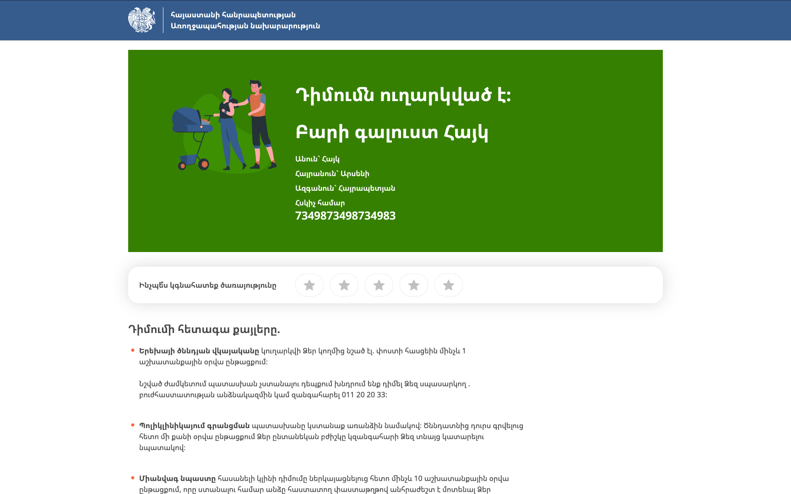
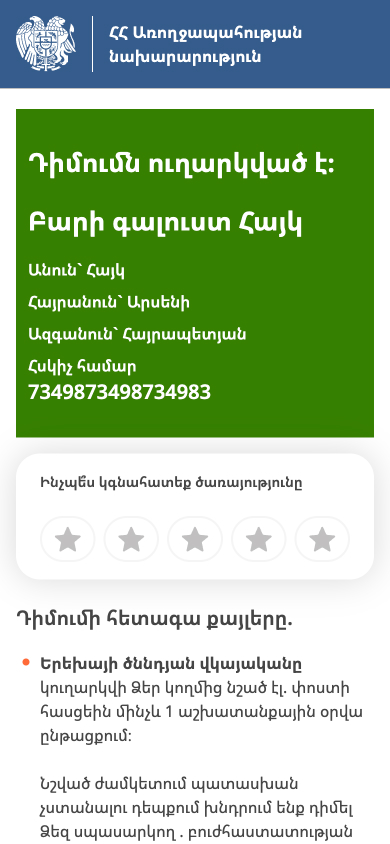
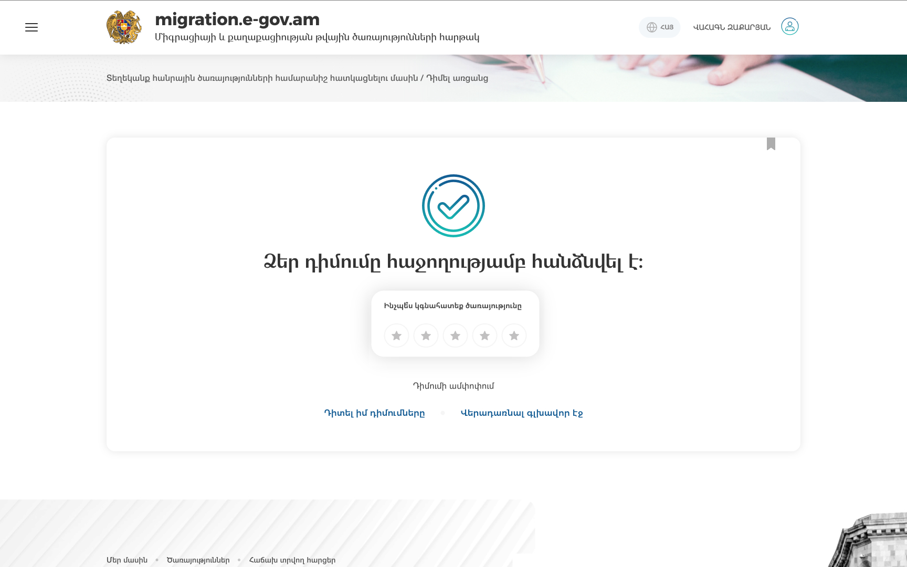
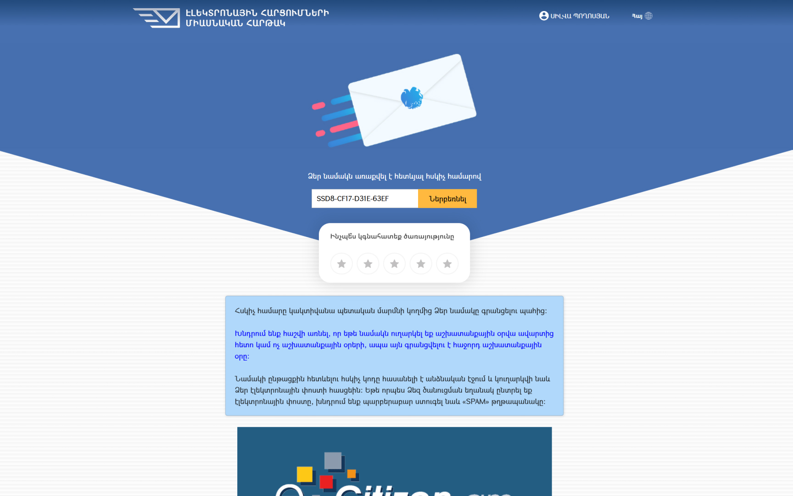

# Օգտատերերի գոհունակության գնահատման վահանակի (Widget) ինտեգրման ուղեցույց

**Ինտեգրման ուղեցույց** \
Դեկտեմբեր 2024 v1.0

## Ընդհանուր նկարագիր

Օգտատերերի գոհունակության գնահատման Widget-ը ստանդարտացված գործիք է Հայաստանում հանրային ծառայություններից օգտվողների գոհունակությունը չափելու համար: Այն կօգնի ծառայություններ ստեղծող թիմերին ապահովել Թվային ծառայությունների նախագծման սկզբունքներով սահմանված՝ [«Թվային ծառայությունների որակի գնահատման 4 հիմնարար ցուցանիշներից»](https://standards.hightech.gov.am/որակի-գնահատման-ցուցանիշներ/) 2-րդի գնահատումը։

3-րդ և 4-րդ ցուցանիշների գնահատման համար կհրապարակվեն առանձին ուղեցույցներ։

Widget-ով ներդրվում է 5-միավորանոց գնահատման համակարգ (հիմք ընդունելով CSAT/NPS մոտեցումները), ինչն օգնում է ծառայություններ մատուցողներին օգտատերերից ստանալ օբյեկտիվ արձագանքներ և դրանց հիման վրա բարելավել հանրային ծառայությունները: Համակարգը կարող է ինտեգրվել ծառայությունների մատուցման մի քանի եղանակների (channel) հետ (օրինակ՝ առցանց թվային ծառայությունների, բջջային հավելվածներով մատուցվող ծառայությունների կամ ֆիզիկապես մատուցվող ծառայությունների հետ՝ գրասենյակներ այցելելուց հետո ներկայացված հետադարձ մեկնաբանությունների հիման վրա):

### Գնահատման սանդղակի նշանակությունը

| Գնահատական | Նշանակություն | Կատեգորիա |
| ---------- | ------------- | --------- |
| 5          | Գերազանց      | Գոհ       |
| 4          | Լավ           | Գոհ       |
| 3          | Բավարար       | Չեզոք     |
| 2          | Վատ           | Դժգոհ     |
| 1          | Շատ վատ       | Դժգոհ     |

### Գոհունակության հաշվարկումը

Օգտատերերի գոհունակության տոկոսը հաշվարկվում է հետևյալ բանաձևով.

```
Satisfaction % = (Number of 4 and 5 ratings / Total responses) × 100
```

## Ինտեգրման քայլ-առ-քայլ ուղեցույց

### Քայլ 1․ Ընտրեք ինտեգրման տեսակը

Կախված ձեր կարիքներից՝ կա ինտեգրման 2 տարբերակ՝

- **Ինտեգրում «Հենակետ»-ով ստեղծված ծառայությանը**․ կիրառեք այս տարբերակը, եթե ձեր ծառայությունը ստեղծվել է [«Հենակետ» դիզայն-համակարգի](https://www.figma.com/community/file/1257654638425705295) բաղադրիչներով, և դիզայնի միասնական մոտեցումները պահպանված են։
- **Ստանդարտ ինտեգրում**․ կիրառեք այս տարբերակը, եթե գործիքն ինտեգրում եք գոյություն ունեցող ծառայության, որը չի ստեղծվել [«Հենակետ» դիզայն-համակարգի](https://www.figma.com/community/file/1257654638425705295) բաղադրիչներով։

### Քայլ 2․ Պատրաստեք անհրաժեշտ պարամետրերը

Հավաքեք հետևյալ տեղեկությունները՝

1. Ծառայության նույնականացման համարը (ID)` կապ հաստատելով ՀՏՀԳ-ի հետ service.admin@isaa.am էլեկտրոնային փոստի հասցեով
2. Ծառայության մատուցման եղանակը (channel, պայմանական է, ըստ կանխադրման՝ առցանց)
3. Ձեր կառույցի նույնականացման համարը (ID, պայմանական է)

Այս տեղեկատվությունը ինտեգրման գործընթացում կտրամադրվի ՀՏՀԳ-ի կողմից։

### Քայլ 3․ Գործարկում

#### Տարբերակ 1․ Ինտեգրում «Հենակետ»-ով ստեղծված ծառայությանը

```html
<iframe
  src="https://nps.services.catalog.isaa.cloud?serviceId=YOUR_SERVICE_ID"
  title="Գնահատեք ծառայությունը"
  style="
    width: 100%;
    height: 126px;
    border: none;
    border-radius: 24px;
    box-shadow: 0 0 34px 0 rgba(0, 0, 0, 0.15);
  "
></iframe>
```

#### Տարբերակ 2․ ստանդարտ ինտեգրում

```html
<iframe
  src="https://nps.services.catalog.isaa.cloud?serviceId=YOUR_SERVICE_ID"
  title="Գնահատեք ծառայությունը"
  style="
    width: 320px;
    height: 126px;
    border: none;
    border-radius: 24px;
    box-shadow: 0 0 34px 0 rgba(0, 0, 0, 0.15);
  "
></iframe>
```

### Քայլ 4․ URL-ում ավելացրեք անհրաժեշտ պարամետրերը

Պահանջվող պարամետրերն ավելացրեք ձեր ծառայության URL-ին

```
https://nps.services.catalog.isaa.cloud?serviceId=YOUR_SERVICE_ID&channel=CHANNEL&institutionId=INSTITUTION_ID
```

Պահանջվող պարամետրեր

| Parameter     | Required | Description                                                                | Example                                |
| ------------- | -------- | -------------------------------------------------------------------------- | -------------------------------------- |
| serviceId     | Այո      | Ծառայության նույնականացման եզակի համարը ծառայությունների ազգային կատալոգից | `d6d9b838-cf95-4312-91fd-3655c2f6ac12` |
| channel       | Ոչ       | Ծառայության մատուցման եղանակը (ըստ կանխադրման՝ առցանց)                     | `online`, `yesem`, `etc.`              |
| institutionId | Ոչ       | Կառույցի նույնականացման եզակի համարը ծառայությունների ազգային կատալոգից    | `d6d9b838-cf95-4312-91fd-3655c2f6ac12` |

### Քայլ 5․ Տեղադրեք Widget-ը

Կատարեք հետևյալ հաջորդական քայլերը՝

1. Տեղադրեք Widget-ը ծառայության վերջին՝ հաստատման էջում։
2. Համոզվեք, որ Widget-ն ամբողջությամբ տեսանելի է էջի վրա՝ առանց էջը թերթելու։
3. Ստուգեք Widget-ի տեսանելիությունը և՛ համակարգչի, և՛ մոբայլ սարքերի վրա։
4. Համոզվեք, որ Widget-ը չի խանգարում էջի այլ տարրերին։

## Պահանջվող չափեր

### Ինտեգրում «Հենակետ»-ով ստեղծված ծառայությանը

- Լայնություն՝ կոնտեյների 100%-ի չափով
- Բարձրություն՝ **iframe-ի լայնության հիման վրա** (ոչ թե էկրանի լայնության):
  - Եթե iframe-ի լայնությունը > 768px, բարձրությունը պետք է լինի 80px
  - Եթե iframe-ի լայնությունը ≤ 768px, բարձրությունը պետք է լինի 126px

**Կարևոր**. բարձրության ճշգրտումը պայմանավորված է հենց iframe-ի լայնությամբ, այլ ոչ թե էկրանի լայնությամբ: Օրինակ՝ եթե iframe-ը գտնվում է 500px լայնությամբ նեղ կոնտեյներում, Widget-ի բարձրությունը կլինի 126px, նույնիսկ եթե օգտատիրոջ էկրանի լայնությունը 1920px է:

### Ստանդարտ ինտեգրում

- Լայնություն՝ ֆիքսված 320px
- Բարձրություն՝ ֆիքսված 126 px
- Widget-ը պետք է արձագանքող (responsive) լինի այս սահմանափակումների շրջանակներում

## Ինտեգրման օրինակներ

### Ինտեգրում «Հենակետ»-ով ստեղծված ծառայությանը

```html
<!-- Note: The height will automatically adjust based on the iframe's width to achieve this you can use CSS media queries-->
<iframe
  src="https://nps.services.catalog.isaa.cloud?serviceId=YOUR_SERVICE_ID"
  title="Գնահատեք ծառայությունը"
  style="
    width: 100%;
    height: 126px;
    border: none;
    border-radius: 24px;
    box-shadow: 0 0 34px 0 rgba(0, 0, 0, 0.15);
  "
></iframe>
```

### Ստանդարտ ինտեգրում

```html
<iframe
  src="https://nps.services.catalog.isaa.cloud?serviceId=YOUR_SERVICE_ID"
  title="Գնահատեք ծառայությունը"
  style="
    width: 320px;
    height: 126px;
    border: none;
    border-radius: 24px;
    box-shadow: 0 0 34px 0 rgba(0, 0, 0, 0.15);
  "
></iframe>
```

## Արձագանքման ձևը

### Բարձրության ճշգրտում՝ հիմնված լայնության վրա (միայն «Հենակետ»-ով ստեղծված ծառայությանն ինտեգրման դեպքում)

Widget-ի բարձրությունը որոշվում է իր լայնությամբ․

1. Եթե iframe-ի լայնությունը ավելի քան 768px է → բարձրությունը կլինի 80px
2. Եթե iframe-ի լայնությունը 768px կամ փոքր է → բարձրությունը կլինի 126px

Օրինակ`

- Եթե iframe-ը տեղադրված է 1000px լայնությամբ կոնտեյներում → բարձրությունը կլինի 80px
- Եթե iframe-ը տեղադրված է 600px լայնությամբ կոնտեյներում → բարձրությունը կլինի 126px
- Եթե iframe-ը տեղադրված է 1920px էկրանի վրա 50% լայնությամբ կոնտեյներում․
  - Եթե կոնտեյների լայնությունը 960px է → բարձրությունը կլինի 80px
  - Եթե կոնտեյների լայնությունը 700px է → բարձրությունը կլինի 126px

## Օրինակներ

### Ինտեգրում «Հենակետ»-ով ստեղծված ծառայությանը

<div style="width: 100%; display: flex; gap: 20px;">
    
    
</div>

### Ստանդարտ ինտեգրում

<div style="display: flex; gap: 20px;">
    
    
</div>

## Խնդիրների բացահայտում և լուծում

### Հաճախակի հանդիպող խնդիրներ և դրանց լուծումները

1. Widget-ը չի ցուցադրվում

   - Համոզվեք, որ միացված եք ցանցին
   - Համոզվեք, որ iframe-ի չափերը համապատասխանում են նվազագույն պահանջներին

2. Չափերի խնդիրներ

   - Ստանդարտ ինտեգրման դեպքում․ համոզվեք, որ կոնտեյների լայնությունը առնվազն 320px է։
   - «Հենակետ»-ով ստեղծված ծառայությանը ինտեգրման դեպքում․ համոզվեք, որ արձագանքող (responsive) CSS-ը ճիշտ է կիրառված։
   - CՀամոզվեք, որ որևէ տարր (Parent element) չի սահմանափակում iframe-ը:

3. Ոճային անհամապատասխանություններ
   - Խուսափեք iframe-ի վրա դիզայնի հավելյալ բաղադրիչներ կիրառելուց՝ բացի տրամադրվածներից։
   - Համոզվեք, որ կոնտեյները (Parent container) չի փոխում iframe-ի ոճերը։

## Աջակցություն

Տեխնիկական աջակցություն ստանալու կամ խնդիրների մասին տեղեկացնելու համար՝

- Էլեկտրոնային փոստի հասցե՝ service.admin@isaa.am

---

**Նշում**. Միշտ փորձարկեք widget-ը թեստային միջավայրում, նախքան այն տեղակայելը(production deployment):
